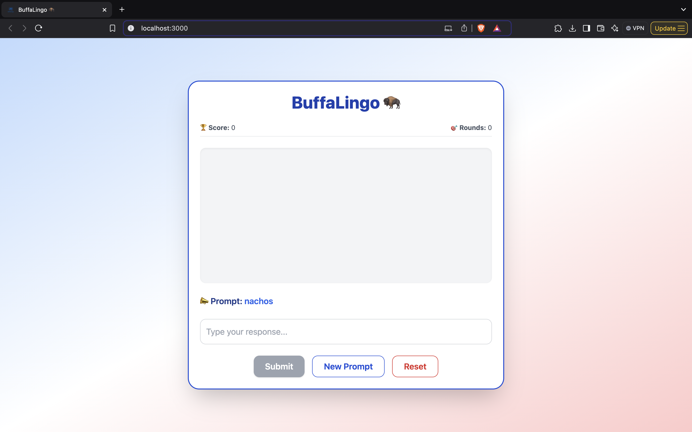
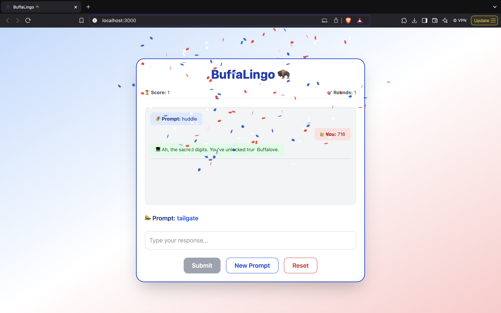

# 🦬 BuffaLingo

**BuffaLingo** is an exciting word association game based on Buffalo, New York. The AI evaluates your answers with sarcasm, humor, and, of course, Buffalonian pride! Whether it's wings, snow, or Zubaz, BuffaLingo will judge your responses in the most Buffalo way possible.

---

## 🎮 Gameplay

1. **Receive a prompt**: A Buffalonian-related word (e.g., “wings,” “blizzard,” “716”).
2. **Type your response**: The more relevant to Buffalo, the better.
3. **AI evaluates**: The AI, acting as a sarcastic Buffalo local, judges your response.  
4. **Score**: Earn points based on your answer’s creativity and Buffalonian relevance.
5. **Easter eggs**: Special responses like "716" trigger confetti and fun sound effects! 🎉

---

## 🛠️ Tech Stack

| Layer       | Tech                       |
|-------------|----------------------------|
| Frontend    | React + TypeScript + Tailwind CSS |
| Backend     | Python Flask API           |
| AI Engine   | Mistral 7B via OpenRouter API |
| Extras      | Canvas Confetti, SoundFX, Easter Eggs |

---

## 🚀 Running Locally

### ⚙️ Prerequisites

- Node.js & npm
- Python 3.8+
- An OpenRouter API key (get one at [openrouter.ai](https://openrouter.ai))

---

### 📦 Backend Setup

1. **Clone the repository**:
   
   ```bash
   git clone <your-repository-url>
   cd backend
   ```

2. **Create a virtual environment**:

   ```bash
   python3 -m venv venv
   source venv/bin/activate  # On Windows, use `venv\Scripts\activate`
   ```

3. **Install dependencies**:

   ```bash
   pip install -r requirements.txt
   ```

4. **Add your OpenRouter API Key**:

   Create a `.env` file in the `backend` folder and add your key:

   ```
   OPENROUTER_API_KEY=your_openrouter_key_here
   ```

5. **Run the backend**:

   ```bash
   python app.py
   ```

   The backend will run at `http://127.0.0.1:5000`.

---

### 💻 Frontend Setup

1. **Navigate to the frontend folder**:

   ```bash
   cd buffalingo-frontend
   ```

2. **Install dependencies**:

   ```bash
   npm install
   ```

3. **Start the app**:

   ```bash
   npm start
   ```

   The frontend will run at `http://localhost:3000`.

---

## 🌟 Features

- 🎯 **Word association scoring**: The AI evaluates how "Buffalonian" your responses are.
- 🎉 **Confetti and sound effects**: Unlock fun rewards with special answers (e.g., “716”).
- 🧠 **AI-generated sarcastic feedback**: Get judged by the AI like a true Buffalonian.
- 🧩 **Prompt history**: See your responses and feedback in the conversation history.
- 🏅 **Live scoreboard**: Track your score and rounds played.
- 💅 **Chat-like interface**: A clean and responsive UI inspired by chat apps.

---


## 📸 Screenshots




---

## 📚 License

This project is licensed under the MIT License - see the [LICENSE](./LICENSE) file for details.

---

## 🙌 Credits

Made with BuffaLove by Sushree Nadiminty 🦬  
Built with love for the Buffalo locals. Go Bills!

---

### 💡 Tips

1. Always use **bleu cheese**, never ranch, to get the true Buffalonian experience.
2. Embrace the sarcasm — it's not just the weather, it's our lifestyle.
